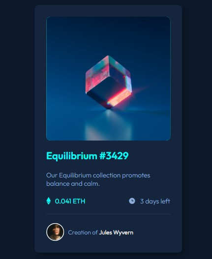

# Frontend Mentor - NFT preview card component solution

This is a solution to the [NFT preview card component challenge on Frontend Mentor](https://www.frontendmentor.io/challenges/nft-preview-card-component-SbdUL_w0U). Frontend Mentor challenges help you improve your coding skills by building realistic projects. 

## Table of contents

- [Overview](#overview)
  - [The challenge](#the-challenge)
  - [Screenshot](#screenshot)
  - [Links](#links)
- [My process](#my-process)
  - [Built with](#built-with)
  - [What I learned](#what-i-learned)
- [Author](#author)


## Overview

### The challenge

Users should be able to:

- View the optimal layout depending on their device's screen size
- See hover states for interactive elements

### Screenshot



### Links

- Solution URL: [GitHub](https://github.com/BryanCarlos/NFT-Preview-card)
- Live Site URL: [GitHub Pages](https://bryancarlos.github.io/NFT-Preview-card/)

## My process

### Built with

- Semantic HTML5 markup
- CSS custom properties
- Flexbox
- CSS Grid

### What I learned

For this project I tried to do a better CSS, and I learn how to use the "&" inside the CSS class.

Here's an example:

```html
    <h2>
      Equilibrium #3429
    </h2>
```
```css
     h2 {
      color: var(--white);
      transition: all .2s;

      &:hover {
        color: var(--cyan);
  }
}
```

## Author

- GitHub - [@BryanCarlos](https://github.com/BryanCarlos)
- Frontend Mentor - [@BryanCarlos](https://www.frontendmentor.io/profile/BryanCarlos)
- LinkedIn - [@bryan-carlos-silva](https://www.linkedin.com/in/bryan-carlos-silva/)